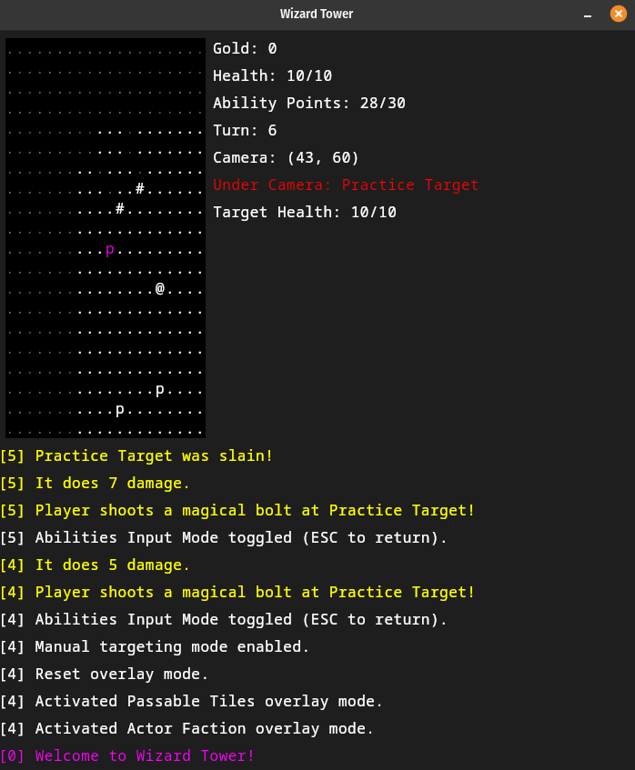

# Wizard Tower
##### Roguelike by sgibber2018

**Description**: This is a Roguelike I've been wanting to make for a long time. The premise is really simple: you are a wizard, and you have just established your tower. You will travel the world, using your spells to increase your power and influence over the game world, becoming a Gandalf or Saruman-like character if you survive that long. The game loop will be simple: pick a dungeon based on some idea of what the reward will be (a spell most likely) -> complete dungeon -> return to tower and make some upgrades -> repeat. However, there will be a metagame where the choice of mission (and the way they are carried out) can have an effect. Perhaps you have been a bad wizard? Maybe mobs attack your tower. Perhaps you are a Gandalf-like figure? Maybe then you are the world's only hope when the underworld invades. I would like to allow for truly ridiculous scope eventually, with long-term goals like "world domination", becoming a Lich, invading the planes of the Gods and causing trouble, founding a School of Magic, and more. I do not want to reward the player for killing mobs in this game, so I am going to balance it around getting rewarded for completing missions/dungeons while giving the player a large variety of ways to do so. It is a Roguelike, so there will be permadeath, but I feel like mighty wizards should be able to cheat death (DnD offers many good examples of how) so I want there to be options for the discerning wizard to do so. I'm going to write the whole thing in Kotlin and I will include a compiled .jar with each version. I am going to use Compose for Desktop for the whole GUI. Eventually, I will use a system of Image-based Tiles but for now the GUI is literally just procedurally-generated columns and rows of Text Composables. To start with, I am going to "wing it" on the RPG and Stats systems and just make something  that feels right. Eventually, I may opt to implement a more established system for things like combat and spell-casting.

**Status and Roadmap**: On hold while I pursue other projects. I will definitely come back to this one though. If anyone wants to take over, be my guest.
